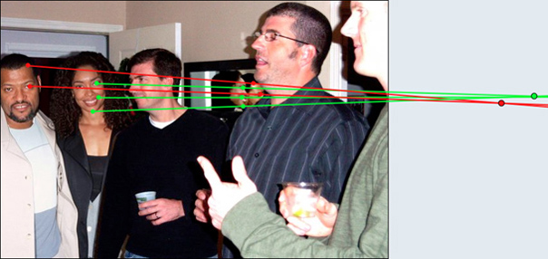
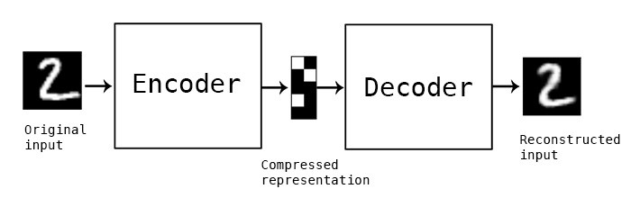

# 1. Gün'de Yapılanlar <!-- omit in toc -->

## İçerikler <!-- omit in toc -->

- [Çalışma Notları](#%C3%87al%C4%B1%C5%9Fma-Notlar%C4%B1)
- [Github Örnekleri](#Github-%C3%96rnekleri)
- [Resimdeki Değişikliliği Algılama](#Resimdeki-De%C4%9Fi%C5%9Fiklili%C4%9Fi-Alg%C4%B1lama)
  - [Göz ile algılama](#G%C3%B6z-ile-alg%C4%B1lama)
  - [Meta Data (EXIF) ile Resim Değişikliğini Algılama](#Meta-Data-EXIF-ile-Resim-De%C4%9Fi%C5%9Fikli%C4%9Fini-Alg%C4%B1lama)
  - [Gölgeler ve Yansımalar ile Resim Değişikliğini Algılama](#G%C3%B6lgeler-ve-Yans%C4%B1malar-ile-Resim-De%C4%9Fi%C5%9Fikli%C4%9Fini-Alg%C4%B1lama)
- [AutoEncoder ile Görüntü İşlemleri](#AutoEncoder-ile-G%C3%B6r%C3%BCnt%C3%BC-%C4%B0%C5%9Flemleri)
- [Harici Bağlantılar](#Harici-Ba%C4%9Flant%C4%B1lar)
- [Ek Bağlantılar](#Ek-Ba%C4%9Flant%C4%B1lar)

## Çalışma Notları

- Doğru arama şekli: `how to recognize if image changed`
- `doctored / forged / manipulated / tampered` = Oynanmış resim
- [Değiştirilmiş Resmi Algılama Yöntemleri]
- [Resim düzenlenmiş mi kontrolü]
- [Online görüntü işleme sitesi]
- [Online Jpeg ya da PNG Analizi]

## Github Örnekleri

Github projelerine `Fake Image Detection` yazarak erişilebilmekte.

- [Fighting Fake News: Image Splice Detection via Learned Self-Consistency]
- [Image Tampering Detection using ELA and CNN]
- [Resmin fotoşop'a uğrayıp uğramadığını anlama] ⚠ **Java**

## Resimdeki Değişikliliği Algılama

### Göz ile algılama

- İnsan yüzlerinde çizikler olur
- Her nokta odağın içerisnde olamaz, bulanık alanların olması lazım
- Fotoraftaki anormallikiler

### Meta Data (EXIF) ile Resim Değişikliğini Algılama

Dijital fotoğraflar `EXIF` formatında meta data içerirler. `EXIF` verisi ile aşağıdaki bilgiler edinilebilir:

- Foto'yu çeken kameranın tipi
- Resmi kaydetmek için son kullanılan yazılım (bazen)
- Yazılımsal değişiklilikleri gösterir

> `EXIF` verisini analiz etmek için [buradaki][jeffrey's image metadata viewer] siteyi kullanabilirsin.
>
> - [Kaynak][three ways to spot if an image has been manipulated]

### Gölgeler ve Yansımalar ile Resim Değişikliğini Algılama

Alttaki resimdeki insanları ve aynadaki yansımlarını baz alan perspektif çizgileri aynı nokatada kesişmediğinden, resim sahtedir.

## AutoEncoder ile Görüntü İşlemleri

AutoEncoder, verideki gürültüyü (noise) yakalayarak verinin boyutunu düşürür.

- Farklı olan resmi bulma
- Resim setindeki gürültüyü kaldırma
  - AutoEncoder resimleri öğrendiği için görültü içerisinde resmi bularak çevresindeki gürültüyü kaldırırken, resmin aslını korur

> [Auto-Encoder: What Is It? And What Is It Used For?]

## Harici Bağlantılar

- [Adobe is using AI to spot Photoshopped Images Easily]
- [Spotting Image Manipulation with AI]
- [Three ways to spot if an image has been manipulated]
- [This is How You Can Tell if an Image has Been Photoshopped]
- [Motion Detection Algorithms]
- [5 Ways to Detect Outliers/Anomalies That Every Data Scientist Should Know (Python Code)]

## Ek Bağlantılar

- [Paper with Code]
- [Learning Hierarchical Semantic Image Manipulation through Structured Representations]

[resim düzenlenmiş mi kontrolü]: http://imageedited.com/
[this is how you can tell if an image has been photoshopped]: https://www.lifehack.org/articles/technology/this-how-you-can-tell-image-has-been-photoshopped.html
[adobe is using ai to spot photoshopped images easily]: https://www.youtube.com/watch?v=rETMDUgAUIg
[spotting image manipulation with ai]: https://theblog.adobe.com/spotting-image-manipulation-ai/
[motion detection algorithms]: https://www.codeproject.com/Articles/10248/Motion-Detection-Algorithms
[three ways to spot if an image has been manipulated]: https://www.poynter.org/reporting-editing/2012/three-ways-to-spot-if-an-image-has-been-manipulated/
[jeffrey's image metadata viewer]: http://exif.regex.info/exif.cgi
[can you spot a photoshopped picture? here are 9 ways to identify a fake photo]: https://www.digitaltrends.com/photography/how-do-you-tell-if-a-photo-is-photoshopped/
[4 ways to tell if a picture was photoshopped just by glancing at it]: https://www.insider.com/how-to-spot-photoshop-2017-12
[online görüntü işleme sitesi]: https://29a.ch/photo-forensics/
[değiştirilmiş resmi algılama yöntemleri]: https://articles.forensicfocus.com/2013/08/22/detecting-forged-altered-images/
[auto-encoder: what is it? and what is it used for?]: https://towardsdatascience.com/auto-encoder-what-is-it-and-what-is-it-used-for-part-1-3e5c6f017726
[5 ways to detect outliers/anomalies that every data scientist should know (python code)]: https://towardsdatascience.com/5-ways-to-detect-outliers-that-every-data-scientist-should-know-python-code-70a54335a623
[online jpeg ya da png analizi]: http://fotoforensics.com/

<!-- Github Örnekleri -->

[fighting fake news: image splice detection via learned self-consistency]: https://github.com/minyoungg/selfconsistency
[resmin fotoşop'a uğrayıp uğramadığını anlama]: https://github.com/Irio/photoshopped-or-not
[image tampering detection using ela and cnn]: https://github.com/agusgun/FakeImageDetector

<!-- Ek bağlantılar -->

[learning hierarchical semantic image manipulation through structured representations]: https://github.com/xcyan/neurips18_hierchical_image_manipulation
[paper with code]: https://github.com/zziz/pwc
