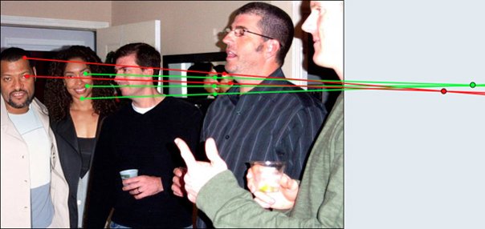

# Resimdeki Değişikliliği Algılama <!-- omit in toc -->

## İçerikler <!-- omit in toc -->

- [Göz ile algılama](#g%c3%b6z-ile-alg%c4%b1lama)
- [Meta Data (EXIF) ile Resim Değişikliğini Algılama](#meta-data-exif-ile-resim-de%c4%9fi%c5%9fikli%c4%9fini-alg%c4%b1lama)
- [Gölgeler ve Yansımalar ile Resim Değişikliğini Algılama](#g%c3%b6lgeler-ve-yans%c4%b1malar-ile-resim-de%c4%9fi%c5%9fikli%c4%9fini-alg%c4%b1lama)
- [Error Level Analysis ile Algılama](#error-level-analysis-ile-alg%c4%b1lama)

## Göz ile algılama

- İnsan yüzlerinde çizikler olur
- Her nokta odağın içerisnde olamaz, bulanık alanların olması lazım
- Fotoraftaki anormallikiler

## Meta Data (EXIF) ile Resim Değişikliğini Algılama

Dijital fotoğraflar `EXIF` formatında meta data içerirler. `EXIF` verisi ile aşağıdaki bilgiler edinilebilir:

- Foto'yu çeken kameranın tipi
- Resmi kaydetmek için son kullanılan yazılım (bazen)
- Yazılımsal değişiklilikleri gösterir

> `EXIF` verisini analiz etmek için [buradaki][jeffrey's image metadata viewer] siteyi kullanabilirsin.
>
> - [Kaynak][three ways to spot if an image has been manipulated]

## Gölgeler ve Yansımalar ile Resim Değişikliğini Algılama

Alttaki resimdeki insanları ve aynadaki yansımlarını baz alan perspektif çizgileri aynı nokatada kesişmediğinden, resim sahtedir.

## Error Level Analysis ile Algılama

> [3 - Error Level Analysis](3%20-%20Error%20Level%20Analysis.md)

[jeffrey's image metadata viewer]: http://exif.regex.info/exif.cgi
[three ways to spot if an image has been manipulated]: https://www.poynter.org/reporting-editing/2012/three-ways-to-spot-if-an-image-has-been-manipulated/
