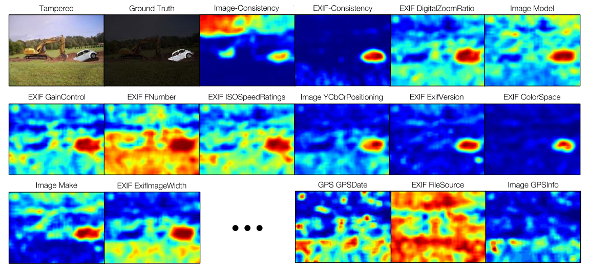
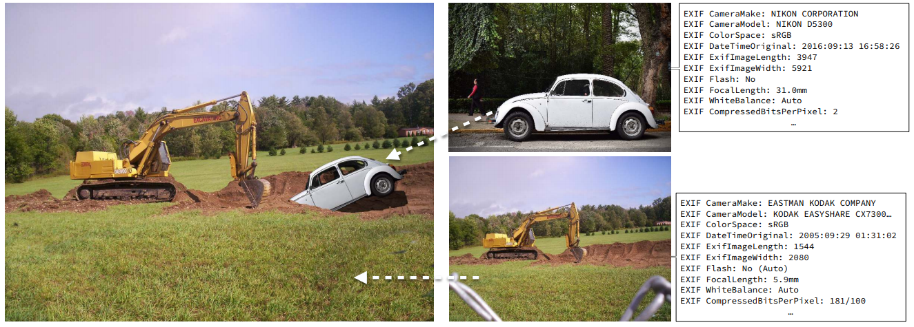

# Fotoşop Algılama <!-- omit in toc -->

Resmin orjinal olup olmadığını algılama ve eklenen verilerin tespiti

## İçerikler <!-- omit in toc -->

- [Temel Ayırma Teknikleri](#temel-ay%c4%b1rma-teknikleri)
  - [EXIF MetaData ile Ayırma](#exif-metadata-ile-ay%c4%b1rma)
- [Error Level Analysis ile Ayırma](#error-level-analysis-ile-ay%c4%b1rma)
- [Noise Analysis ile Ayırma](#noise-analysis-ile-ay%c4%b1rma)
- [Code Kısmı](#code-k%c4%b1sm%c4%b1)
- [Kişisel Notlar](#ki%c5%9fisel-notlar)
- [Faydalı Linkler](#faydal%c4%b1-linkler)
  - [Notlar](#notlar)
  - [Yapılacaklar](#yap%c4%b1lacaklar)
- [Ek Bağlantılar](#ek-ba%c4%9flant%c4%b1lar)
- [Referanslar](#referanslar)

## Temel Ayırma Teknikleri

### EXIF MetaData ile Ayırma

Her EXIF metadata özelliği için confidency matrix oluşturulur.

- Her bir _confidency matrix_ birbirinden bağımsız işlenir
- Tüm _confidency matrix_'lerin ortalaması alınır (_mean shift_)
- Her JPEG dosyası resmin kimlik verileri olan **EXIF Metadata** sahiptir
- Her frame'in metadata'larına bakılır ve farklılık söz konusu olursa resim değiştirilmiş demektir

## Error Level Analysis ile Ayırma

## Noise Analysis ile Ayırma

- Doğal resimler gürültülerle doludur
- Oynama yapıldığında gürültülerde belli olacak bir iz bırakırlar
- Airbrushing, Warps, Deforms, transformed clones yöntemleri ile değiştirilen resimleri bulamada avantaj sağlar

> Aclone detection ve ELA bazen bunları yaklayamayabilmekte.

> - [Buradaki](https://29a.ch/2015/08/21/noise-analysis-for-image-forensics) yazı faydalı olacaktır.
> - [Noise filtering in Digital Image Processing](https://medium.com/image-vision/noise-filtering-in-digital-image-processing-d12b5266847c)

## Code Kısmı

[Buradaki](https://github.com/minyoungg/selfconsistency/blob/master/demo.ipynb) kod incelenerek model bulunacak.

- `exif_demo` metodu tüm işlemini gerçekleştiği yer.
- `mean_shift` algoritması kullanmakta

## Kişisel Notlar

## Faydalı Linkler

- [Mean Shift ile Hareketli Nesne Algılama](http://mesutpiskin.com/blog/agirlikli-ortalama-oteleme-algoritmasi-mean-shift-ile-hareketli-nesne-takibi.html)

### Notlar

- Adobe AI çalıştırıabilir hale getirildi
  - Kodlar: [notebook](../src/adobe_ai.ipynb), [python](../src/adobe_ai.py)
  - Tam olarak bulamıyor 😢
  - Sadece yüzleri ile çalışmakta

### Yapılacaklar

- [Buradaki](https://arxiv.org/pdf/1805.04096.pdf) paper'a devam edilecek
- [Demo kodundan](https://github.com/minyoungg/selfconsistency/blob/master/demo.ipynb) kaynak kodu anlaşılmaya çalışılacak
- Confidency matrix oluşturmaya bakılacak
- Affinity matrix'in detaylarına bakılacak

## Ek Bağlantılar

- [Image forgery detection](https://towardsdatascience.com/image-forgery-detection-2ee6f1a65442)

## Referanslar

- [Makale (Paper)](https://arxiv.org/pdf/1805.04096.pdf)
  - To model post-processing consistency, we add three augmentation operations during training: re-JPEGing, Gaussian blur, and image resizing
- [Proje](https://github.com/minyoungg/selfconsistency)
- [Projenin web sitesi](https://minyoungg.github.io/selfconsistency/)
- [Veriseti](http://people.eecs.berkeley.edu/~owens/consistency/exif_final.zip)
- [Photoshop veri seti](https://minyoungg.github.io/selfconsistency/in_wild/in_wild.tar.gz)
- [Adobe AI Fotoşop Algılama](http://openaccess.thecvf.com/content_cvpr_2018/papers/Zhou_Learning_Rich_Features_CVPR_2018_paper.pdf)
