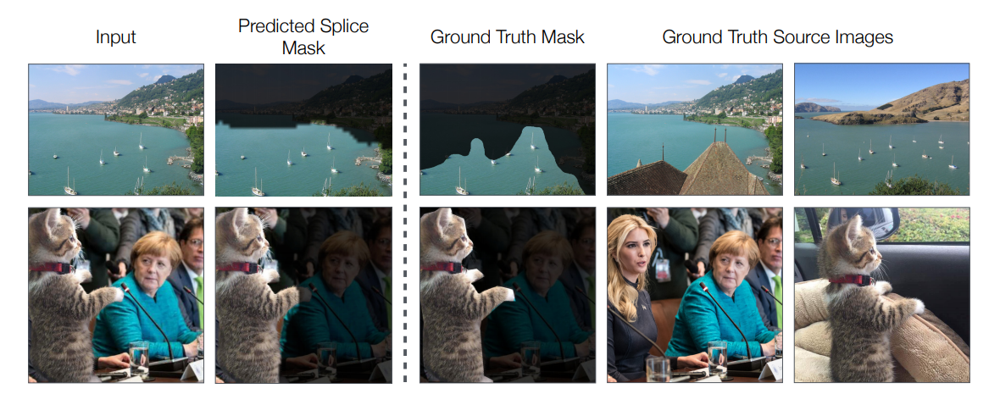
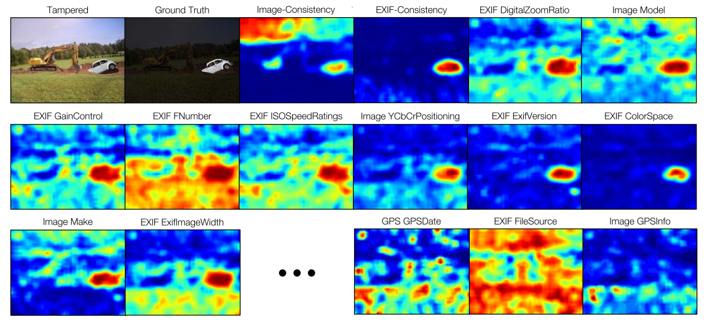
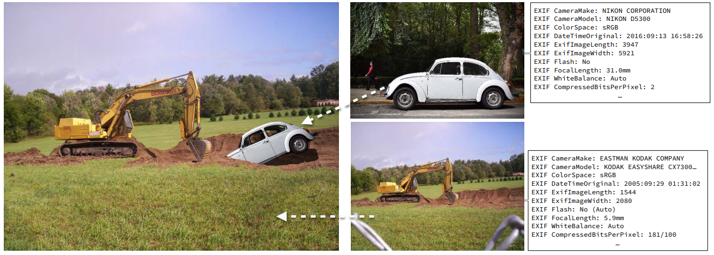

# Fotoşop Algılama <!-- omit in toc -->

Resmin orjinal olup olmadığını algılama ve eklenen verilerin tespiti

## İçerikler <!-- omit in toc -->

- [Temel Ayırma Teknikleri](#Temel-Ay%C4%B1rma-Teknikleri)
  - [EXIF MetaData ile Ayırma](#EXIF-MetaData-ile-Ay%C4%B1rma)
- [Code Kısmı](#Code-K%C4%B1sm%C4%B1)
- [Yapılacaklar](#Yap%C4%B1lacaklar)
- [Ek Bağlantılar](#Ek-Ba%C4%9Flant%C4%B1lar)
- [Referanslar](#Referanslar)
  <<<<<<< HEAD
- # [Ek Bağlantılar](#Ek-Ba%C4%9Flant%C4%B1lar)
  > > > > > > > 6512f35c25beb40bcbc3a74a06ba45dba37adfe1
- [Referanslar](#Referanslar)

## Temel Ayırma Teknikleri

Her EXIF metadata özelliği için confidency matrix oluşturulur.

- Her bir _confidency matrix_ birbirinden bağımsız işlenir
- Tüm _confidency matrix_'lerin ortalaması alınır (_mean shift_)

### EXIF MetaData ile Ayırma

- Her JPEG dosyası resmin kimlik verileri olan **EXIF Metadata** sahiptir
- Her frame'in metadata'larına bakılır ve farklılık söz konusu olursa resim değiştirilmiş demektir

## Code Kısmı

[Buradaki](https://github.com/minyoungg/selfconsistency/blob/master/demo.ipynb) kod incelenerek model bulunacak.

- `exif_demo` metodu tüm işlemini gerçekleştiği yer.

## Yapılacaklar

- [Buradaki](https://arxiv.org/pdf/1805.04096.pdf) paper'a devam edilecek
- [Demo kodundan](https://github.com/minyoungg/selfconsistency/blob/master/demo.ipynb) kaynak kodu anlaşılmaya çalışılacak
- Confidency matrix oluşturmaya bakılacak
- Affinity matrix'in detaylarına bakılacak

## Ek Bağlantılar

- [Image forgery detection](https://towardsdatascience.com/image-forgery-detection-2ee6f1a65442)

## Referanslar

- [Makale (Paper)](https://arxiv.org/pdf/1805.04096.pdf)
- [Proje](https://github.com/minyoungg/selfconsistency)
- [Projenin web sitesi](https://minyoungg.github.io/selfconsistency/)
- [Veriseti](http://people.eecs.berkeley.edu/~owens/consistency/exif_final.zip)
- [Photoshop veri seti](https://minyoungg.github.io/selfconsistency/in_wild/in_wild.tar.gz)
